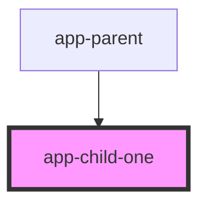

# app-child-one

<!-- Auto Generated Below -->

## Properties

| Property             | Attribute | Description | Type       | Default     |
| -------------------- | --------- | ----------- | ---------- | ----------- |
| `parentClickHandler` | --        |             | `Function` | `undefined` |

## Dependencies

### Used by

 - [app-parent](../app-parent)

### Graph

----------------------------------------------

*Built with [StencilJS](https://stenciljs.com/)*
