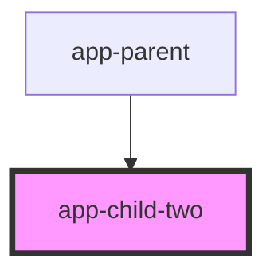

# app-child-two

<!-- Auto Generated Below -->

## Methods

### `addText(newText: any) => Promise<void>`

#### Returns

Type: `Promise<void>`

## Dependencies

### Used by

 - [app-parent](../app-parent)

### Graph

----------------------------------------------

*Built with [StencilJS](https://stenciljs.com/)*
